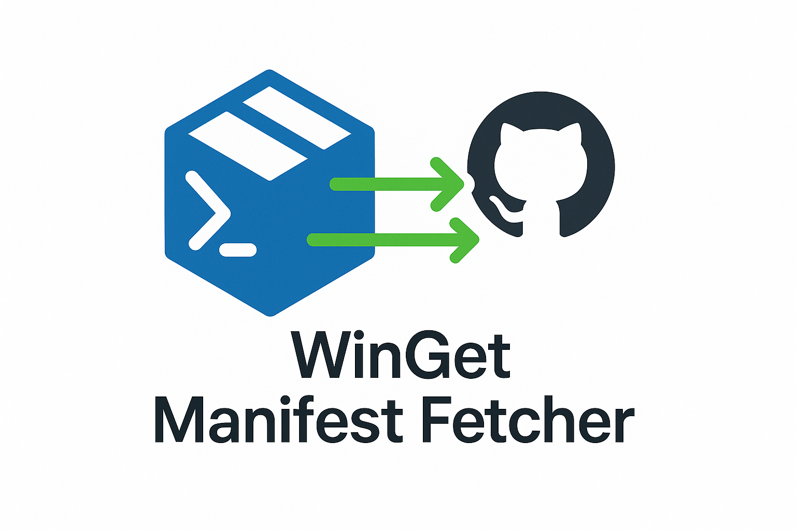

<div align="center">
  
  
  # WinGet Manifest Fetcher
  
  [](https://www.powershellgallery.com/packages/WinGetManifestFetcher)
  [](https://www.powershellgallery.com/packages/WinGetManifestFetcher)
  [](LICENSE)
  
  A PowerShell module that retrieves installer information from WinGet manifests directly from the [microsoft/winget-pkgs](https://github.com/microsoft/winget-pkgs) repository without requiring the WinGet client to be installed.
</div>

## 🚀 Features

- **Direct Repository Access**: Query WinGet manifests directly from GitHub
- **No WinGet Client Required**: Works on any system with PowerShell (Windows/macOS/Linux)
- **Download Installers**: Download installers with SHA256 hash verification
- **Publisher Search**: Find all packages from a specific publisher  
- **Version Source Optimization**: Use direct paths for faster package retrieval
- **Comprehensive Package Information**: Retrieve all metadata including installers, URLs, hashes, and more
- **Flexible Search Options**: Search by full package ID, partial names, or publisher
- **Architecture Filtering**: Download specific architectures (x64, x86, arm64)
- **Installer Type Filtering**: Filter by installer type (exe, msi, msix, etc.)
- **PowerShell Native**: Built entirely in PowerShell with minimal dependencies
- **Local Caching**: Automatic caching to reduce API calls and improve performance
- **Cross-Platform**: Works on Windows, macOS, and Linux

## 📋 Prerequisites

- PowerShell 5.1 or higher (PowerShell 7+ recommended)
- [PowerShellForGitHub](https://github.com/microsoft/PowerShellForGitHub) module (v0.16.0+)
- [powershell-yaml](https://github.com/cloudbase/powershell-yaml) module (v0.4.0+)
- Internet connection to access GitHub

## 🔧 Installation

### Install from PowerShell Gallery (Recommended)

```powershell
# Install the module from PowerShell Gallery
Install-Module -Name WinGetManifestFetcher -Scope CurrentUser

# Import the module
Import-Module WinGetManifestFetcher
```

The module will automatically install its dependencies (PowerShellForGitHub and powershell-yaml).

### Update the Module

```powershell
# Update to the latest version
Update-Module -Name WinGetManifestFetcher
```

### Install from Source

If you want to contribute or use the latest development version:

```powershell
# Clone the repository
git clone https://github.com/jorgeasaurus/WinGet-Manifest-Fetcher.git
cd WinGet-Manifest-Fetcher

# Install required modules
Install-Module -Name PowerShellForGitHub -MinimumVersion 0.16.0 -Scope CurrentUser
Install-Module -Name powershell-yaml -MinimumVersion 0.4.0 -Scope CurrentUser

# Build the module
./build.ps1

# Import the module
Import-Module ./output/WinGetManifestFetcher/WinGetManifestFetcher.psd1
```

### Configure GitHub Authentication (Optional but Recommended)

To avoid GitHub API rate limits, configure authentication using a GitHub Personal Access Token. You can create one by following [GitHub's documentation](https://docs.github.com/en/authentication/keeping-your-account-and-data-secure/managing-your-personal-access-tokens).

```powershell
# Option 1: Use environment variable
$env:GITHUB_TOKEN = "your_github_personal_access_token"

# Option 2: Use PowerShellForGitHub authentication
$secureToken = ConvertTo-SecureString -String "your_github_personal_access_token" -AsPlainText -Force
$credential = New-Object System.Management.Automation.PSCredential("token", $secureToken)
Set-GitHubAuthentication -Credential $credential
```

## 🚀 Quick Start

```powershell
# Install and import the module
Install-Module -Name WinGetManifestFetcher -Scope CurrentUser
Import-Module WinGetManifestFetcher

# Get package information
Get-LatestWingetVersion -App "Microsoft.PowerToys"

# Download an installer
Save-WingetInstaller -App "7zip.7zip" -Path "C:\Downloads"

# Search by publisher
Get-WingetPackagesByPublisher -Publisher "Microsoft" -MaxResults 10
```

## 📖 Usage

### Get Latest Version Information

```powershell
# Get latest version info for a package
Get-LatestWingetVersion -App "Microsoft.VisualStudioCode"

# Search with partial name
Get-LatestWingetVersion -App "notepad"

# Use version source for faster retrieval
Get-LatestWingetVersion -App "7zip.7zip" -VersionSource "manifests/7/7zip/7zip"
```

### Download Installers with Hash Verification

```powershell
# Download latest installer for a package
Save-WingetInstaller -App "7zip.7zip" -Path "C:\Downloads"

# Download specific architecture
Save-WingetInstaller -App "Git.Git" -Architecture "x64" -Path "./Downloads"

# Download specific installer type
Save-WingetInstaller -App "Notepad++.Notepad++" -InstallerType "nullsoft" -Path "./Downloads"

# Download with verbose output to see hash verification
Save-WingetInstaller -App "Microsoft.VisualStudioCode" -Verbose

# Skip hash validation (not recommended)
Save-WingetInstaller -App "VideoLAN.VLC" -SkipHashValidation

# Use WhatIf to preview download
Save-WingetInstaller -App "Mozilla.Firefox" -WhatIf

# Download and get file information
$file = Save-WingetInstaller -App "Python.Python.3.12" -PassThru
$file | Format-List Name, Length, PackageVersion, Architecture, HashVerified
```

### Search by Publisher

```powershell
# Get all packages from a publisher
Get-WingetPackagesByPublisher -Publisher "Microsoft"

# Limit results
Get-WingetPackagesByPublisher -Publisher "Adobe" -MaxResults 10

# Include version information
Get-WingetPackagesByPublisher -Publisher "JetBrains" -IncludeVersions -MaxResults 5

# Search with partial publisher name
Get-WingetPackagesByPublisher -Publisher "Video"
```

### Advanced Examples

```powershell
# Get specific installer types
$result = Get-LatestWingetVersion -App "Git.Git"
$result.Installers | Where-Object { $_.Architecture -eq 'x64' }

# Export package information to JSON
Get-LatestWingetVersion -App "Mozilla.Firefox" | ConvertTo-Json -Depth 5 | Out-File firefox-info.json

# Get all Google packages with version information
Get-WingetPackagesByPublisher -Publisher "Google" -IncludeVersions
```

## 🧪 Testing

The module includes comprehensive Pester tests:

### Running Tests

```powershell
# Use the build script to run tests
./build.ps1 -Task Test

# Use the test runner script (recommended)
./Tests/run-unit-tests.ps1

# Or run specific tests that are compatible
./build.ps1 -Task Build
Import-Module ./output/WinGetManifestFetcher/WinGetManifestFetcher.psd1 -Force
Invoke-Pester ./Tests/Unit/Save-WingetInstaller.Tests.ps1 -Output Detailed
```

### Test Structure

- **Unit Tests**: Fast, isolated tests that use mocked GitHub API responses
- **Integration Tests**: Real API calls to verify actual functionality
- **Fixtures**: Mock manifest data for consistent offline testing

## 📊 Performance Optimization

### Using Version Source Paths

For faster lookups, you can provide the version source path directly when you know the package location:

```powershell
# Use version source for faster retrieval
Get-LatestWingetVersion -App "7zip.7zip" -VersionSource "manifests/7/7zip/7zip"
```

Using version source paths typically provides 50-70% faster retrieval times compared to searching.

## 🔍 Available Functions

### Get-LatestWingetVersion

Retrieves the latest version information for a specific package.

**Parameters:**

- `-App` (Required): The application name or package identifier
- `-VersionSource` (Optional): Direct path to the package in the repository

**Returns:** PSCustomObject with full package metadata including all installers

### Save-WingetInstaller

Downloads installers with SHA256 hash verification.

**Parameters:**

- `-App` (Required): The package identifier (e.g., 'Microsoft.PowerToys')
- `-Path` (Optional): Directory to save the installer (defaults to current directory)
- `-Architecture` (Optional): Architecture to download (x64, x86, arm64, arm, neutral)
- `-InstallerType` (Optional): Installer type to download (exe, msi, msix, etc.)
- `-Force` (Optional): Overwrite existing files
- `-SkipHashValidation` (Optional): Skip SHA256 hash verification (not recommended)
- `-PassThru` (Optional): Return downloaded file information

**Returns:** Downloaded file information (with PassThru) or downloads to specified path

### Get-WingetPackagesByPublisher

Searches for all packages from a specific publisher.

**Parameters:**

- `-Publisher` (Required): The publisher name (supports partial matching)
- `-IncludeVersions` (Optional): Include latest version information for each package
- `-MaxResults` (Optional): Maximum number of packages to return

**Returns:** Array of PSCustomObject with package information

## 📁 Project Structure

```
WinGet-Manifest-Fetcher/
├── src/                          # Source code
│   ├── WinGetManifestFetcher.psm1   # Main module file
│   ├── WinGetManifestFetcher.psd1   # Module manifest
│   ├── Public/                      # Public functions
│   │   ├── Get-LatestWingetVersion.ps1
│   │   ├── Get-WingetPackagesByPublisher.ps1
│   │   ├── Save-WingetInstaller.ps1
│   │   ├── Clear-WingetManifestCache.ps1
│   │   ├── Get-WingetManifestCacheInfo.ps1
│   │   └── Set-WingetManifestCacheEnabled.ps1
│   └── Private/                     # Private functions
├── Tests/                        # Pester tests
│   ├── Unit/                       # Unit tests
│   └── TestHelper.ps1             # Test utilities
├── Examples/                     # Example scripts
├── output/                      # Built module (generated)
├── build.ps1                    # Build script
├── WinGetManifestFetcher.build.ps1  # InvokeBuild tasks
└── README.md                    # This file
```

## 💾 Caching

The module includes automatic caching to improve performance and reduce GitHub API calls. Cache files are stored in the user's local application data directory.

### Cache Management Commands

```powershell
# Get cache information
Get-WingetManifestCacheInfo

# Clear the cache
Clear-WingetManifestCache        # Prompts for confirmation
Clear-WingetManifestCache -Force # Clears without prompting

# Disable/Enable caching
Set-WingetManifestCacheEnabled -Enabled $false  # Disable
Set-WingetManifestCacheEnabled -Enabled $true   # Enable
```

### Cache Configuration

- **Default Locations**:
  - Windows: `%LOCALAPPDATA%\WinGetManifestFetcher\Cache`
  - macOS: `~/Library/Caches/WinGetManifestFetcher`
  - Linux: `~/.cache/WinGetManifestFetcher` (or `$XDG_CACHE_HOME/WinGetManifestFetcher`)
- **Default Expiration**: 60 minutes
- **Cache Format**: JSON files with timestamp and version metadata

### Cache Behavior

- Package information is cached automatically after successful retrieval
- Cached data is returned if it exists and hasn't expired
- Invalid or expired cache entries are automatically cleaned up
- Different cache keys are used for different query parameters

## ⚠️ Troubleshooting

### Common Issues

1. **"Package not found" errors**

   - Verify the package identifier is correct
   - Try searching with partial names
   - Check if the package exists in the [winget-pkgs repository](https://github.com/microsoft/winget-pkgs)

2. **GitHub API rate limit errors**

   - Configure GitHub authentication (see Installation section)
   - Use version source paths when possible
   - Implement delays between requests for batch operations

3. **YAML parsing errors**

   - Update the powershell-yaml module: `Update-Module powershell-yaml`
   - Some manifests may be malformed - the module will skip these

4. **Slow performance**
   - Use the `-VersionSource` parameter when you know the package path
   - Configure GitHub authentication to increase rate limits
   - Use `app-paths.json` for common applications

## 🤝 Contributing

Contributions are welcome! Please:

1. Fork the repository
2. Create a feature branch (`git checkout -b feature/amazing-feature`)
3. Commit your changes (`git commit -m 'Add amazing feature'`)
4. Push to the branch (`git push origin feature/amazing-feature`)
5. Open a Pull Request

## 📄 License

This project is licensed under the MIT License - see the [LICENSE](LICENSE) file for details.

## 🙏 Acknowledgments

- [PowerShellForGitHub](https://github.com/microsoft/PowerShellForGitHub) for GitHub API integration
- [powershell-yaml](https://github.com/cloudbase/powershell-yaml) for YAML parsing
- [WinGet Community](https://github.com/microsoft/winget-pkgs) for maintaining the package repository

## 📚 Related Projects

- [WinGet CLI](https://github.com/microsoft/winget-cli) - The official Windows Package Manager
- [WinGet Packages Repository](https://github.com/microsoft/winget-pkgs) - The community repository of packages
- [WinGetty](https://github.com/jdhitsolutions/WinGetty) - Another PowerShell module for WinGet

## 🚧 Roadmap

- [x] Core package search functionality
- [x] Publisher search support
- [x] Version source optimization
- [x] Comprehensive test suite
- [x] Download functionality with hash verification
- [x] Local caching mechanism
- [x] Cross-platform support
- [ ] Version history retrieval
- [ ] Manifest validation
- [ ] Dependency resolution
- [x] PowerShell Gallery publication (in progress)

---

**Note:** This module is not affiliated with Microsoft or the official WinGet project. It's an independent tool that reads publicly available data from the winget-pkgs repository.
